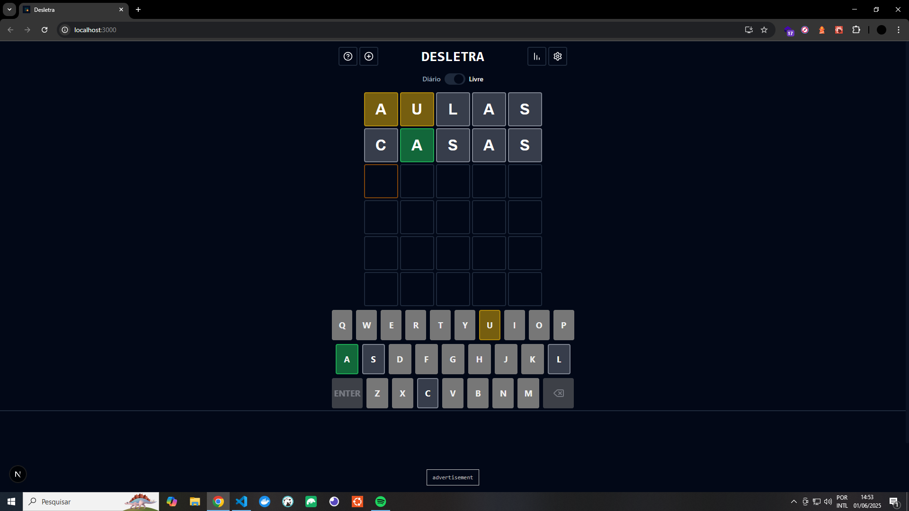
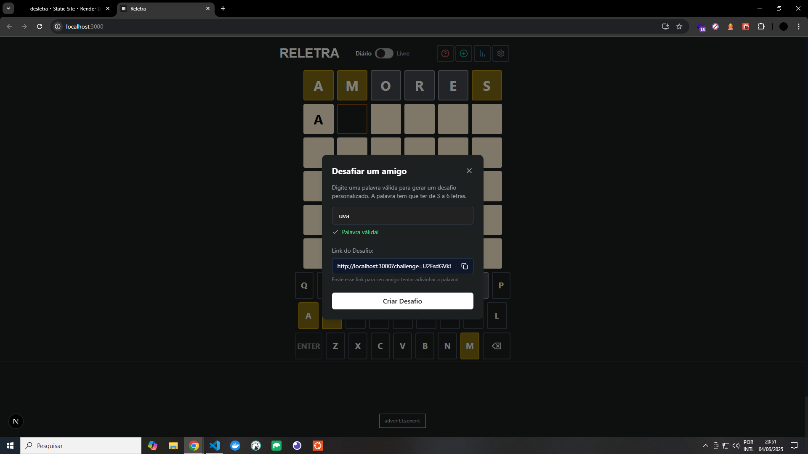

[](https://twitter.com/t_h_e_u)
[](https://www.linkedin.com/in/matheusgbatista/)
[](https://t-heu.github.io)

## Getting Started

First, run command:

```bash
npm install
```

Second, run the development server:

```bash
npm run dev
```

Open [http://localhost:3000](http://localhost:3000) with your browser to see the result.

## Learn More


Palavras Cruzadas Codificadas é um desafio diário de lógica onde você precisa decifrar um código secreto para revelar as palavras cruzadas corretas. A cada dia, um novo tema é revelado (como “Frutas”), e as letras embaralhadas precisam ser trocadas até que todas as palavras façam sentido. Use dicas, raciocínio e estratégia para completar o tabuleiro!

## 🖼️ Preview



